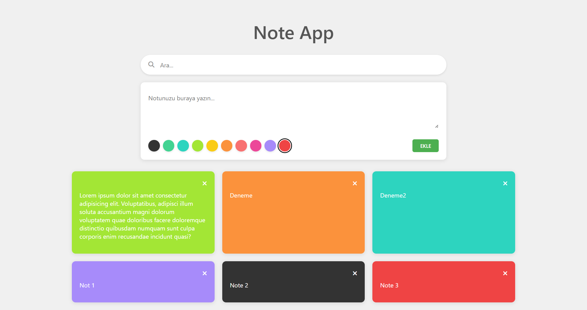

# 📝 Notes App | React + Vite

Basit ve kullanıcı dostu bir not alma uygulamasıdır. React ve Vite kullanılarak geliştirilmiştir.
* Bu proje, Patika Frontend Bootcamp'i için oluşturulan **Hafta-10 - Odev-2 | Note App** projesidir.
* Temel not alma ve arama işlevselliğine sahip bir uygulamadır.
* **React**, **Vite**, **CSS3** ve **JavaScript** kullanılmıştır.
* React Hooks ile state yönetimi sağlanmıştır.

---

## :computer: Kullanım

1. Projeyi klonlayın
```bash
git clone https://github.com/tunahanyasar/Hafta-10.git
```

2. Proje klasörüne gidin
```bash
cd Odev-2
```

3. Bağımlılıkları yükleyin
```bash
npm i
```

4. Geliştirme sunucusunu başlatın
```bash
npm run dev
```

---

## 📜 Proje Yapısı

:open_file_folder: **Klasörler;**
* *src/*
  * *components/*
    * *Note.jsx*
    * *NoteForm.jsx*
    * *NoteList.jsx*
    * *SearchBar.jsx*
    * *NoteApp.jsx*
  * *App.jsx*
  * *App.css*
  * *main.jsx*
  * *index.css*
* *index.html*
* *package.json*

1. ***src/components/***: React bileşenleri bu klasörde bulunur.
    * **Note.jsx**: Tekil not kartı bileşeni.
    * **NoteForm.jsx**: Not ekleme formunu içeren bileşen.
    * **NoteList.jsx**: Not listesini yöneten bileşen.
    * **SearchBar.jsx**: Arama işlemlerini yöneten bileşen.
    * **NoteApp.jsx**: Ana uygulama bileşeni.

2. ***App.css***: Tüm CSS özellikleri.

3. ***App.jsx***: Ana uygulama dosyası.

---

## :star2: Mevcut Özellikler

1. **Not İşlemleri**
   - Not ekleme
   - Not silme
   - Renk seçimi
   - Not içeriği düzenleme

2. **Arama İşlemleri**
   - Kelime tabanlı arama yapma
   - Anlık filtreleme

3. **Modern UI/UX**
   - Kullanıcı dostu arayüz
   - Responsive tasarım
   - Temiz ve düzenli kod yapısı

## 🔄 İleride Eklenecek Özellikler

1. **Gelişmiş Not İşlemleri**
   - Not düzenleme ve güncelleme
   - Not kopyalama
   - Çöp kutusu yönetimi
      - Silinen notları geri getirme
      - Kalıcı silme seçeneği

2. **Gelişmiş Arama ve Filtreleme**
   - Renk tabanlı filtreleme
   - Çöp kutusu içinde arama
   - Çöp kutusu içinde renk filtresi

3. **Metin Formatlaması**
   - Başlık: Her kelimenin ilk harfi büyük
   - İçerik: Her satırın ilk kelimesinin ilk harfi büyük
   - Satır sonları korunması

4. **Yerel Depolama**
   - Notların tarayıcı yerel depolamasında saklanması
   - Çöp kutusu içeriğinin yerel depolamada tutulması

5. **Yardım Sistemi**
   - Detaylı kullanım rehberi
   - İkon rehberi
   - Sayfa kullanımı hakkında bilgiler

6. **Responsive Tasarım**
    - Sayfa düzeni için CSS Grid ve Flexbox kullanılarak farklı ekran boyutlarına uyumlu tasarım

 ---

## 💡 Kullanılan Yapılar | Kazanımlar

**React:**
* Component Mimarisi
* Props Sistemi
* React Hooks (useState, useEffect)
* Event Handling
* Conditional Rendering

**CSS:**
* Flexbox Layout
* CSS Grid
* Transform & Transitions
* Responsive Design
* Custom Properties

**JavaScript:**
* ES6+ Özellikleri
* Array Metodları
* String Manipülasyonu
* Event Handling
* State Management

---

# :paperclip: Sayfa Çıktıları

### Fullpage



---
## 🎮 Nasıl Kullanılır?

1. Not Ekleme:
   - Metin alanına notunuzu yazın
   - İstediğiniz rengi seçin
   - "EKLE" butonuna tıklayın

2. Not Silme:
   - Silmek istediğiniz notun sağ üst köşesindeki silme butonuna tıklayın

3. Not Arama:
   - Üst kısımdaki arama çubuğuna aramak istediğiniz kelimeyi yazın
   - Notlar otomatik olarak filtrelenecektir

---

## 🔍 Detaylı Açıklama

### Proje Amacı ve Kapsamı

Bu proje, kullanıcıların notlarını kolayca yönetebilecekleri, basit ve kullanıcı dostu bir not alma uygulamasıdır. React ile modern bir kullanıcı arayüzü oluşturulmuştur.

### Teknik Detaylar

#### NoteApp.jsx - Ana Uygulama Bileşeni

**NoteApp.jsx** dosyası, uygulamanın ana bileşenidir ve şu önemli işlevleri içerir:

1. **State Yönetimi**: 
   - useState hook'ları ile notlar ve arama durumu yönetilir
   - useEffect hook'u ile filtreleme işlemleri yapılır

2. **Layout Yapısı**:
   - Başlık ve arama çubuğu üst kısımda
   - Not formu ve not listesi alt kısımda
   - CSS Grid ve Flexbox ile responsive tasarım

#### Kullanıcı Deneyimi
- **Görsel Geri Bildirimler**: Not eklendiğinde ve silindiğinde görsel geri bildirimler
- **Renk Seçimi**: Kolay renk seçimi
- **Arama**: Anlık filtreleme ile hızlı arama


### Gelecek Geliştirmeler

- **Kategori Sistemi**: Notların kategorilere göre organize edilmesi
- **Etiket Sistemi**: Notlara etiket ekleme ve filtreleme
- **Dışa/İçe Aktarma**: Notları dışa ve içe aktarma özelliği
- **Tema Seçenekleri**: Koyu/açık tema seçenekleri
- **Sıralama Seçenekleri**: Notları tarihe veya renge göre sıralama
- **Paylaşım Özellikleri**: Notları sosyal medyada paylaşma
- **Çoklu Dil Desteği**: Farklı dil seçenekleri

---

## 👤 İletişim

[GitHub](https://github.com/tunahanyasar)
